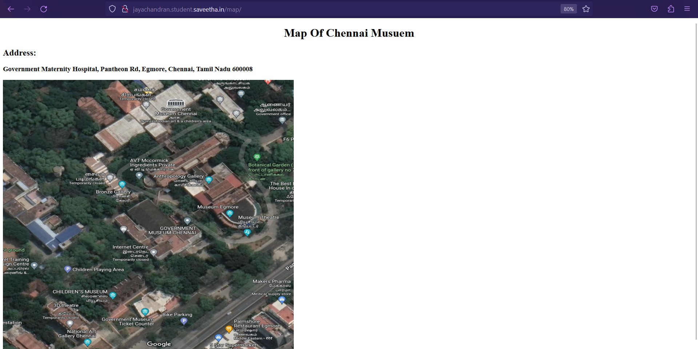
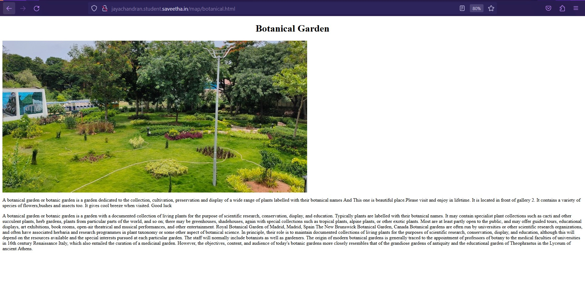
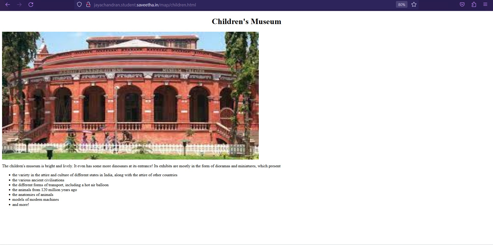

# Places Around Me
## AIM:
To develop a website to display details about the places around my house.

## Design Steps:

## Step 1:

Create a new django project and app
## Step 2:

Add a new imagemap html file in templates and neede images in static folder and define it in settings.
## Step 3:

Type ur image map code in the html with coordinates and target file to redirect on click
## Step 4:

Define your components pages and create content in such a way that it gives information about place which is being clicked
## Step 5:

Include pictures and contents for your subpages and map them using urls and views
## Code:
Include your HTML code here
# MAP:
  ```<!DOCTYPE html>
<html>
    <head>
        <title>Chennai Musuem Image Map</title>
    </head>
    <body>
        <h1 align='center'> Map Of Chennai Musuem</h1>
        <h2  align='left'>Address:</h2>
        <h3 align='left'>Government Maternity Hospital, Pantheon Rd, Egmore, Chennai, Tamil Nadu 600008</h3>
        
        <map name="museummap">
            <area  alt="" title="Main Building" href="museum.html" shape="poly" coords="170,72,232,188,276,246,421,172,516,69,602,144,637,117,590,35,397,33,290,35" style="outline:none;" target="_self"     />
            <area  alt="" title="Botanical Garden" href="botanical.html" shape="poly" coords="595,213,690,409,696,486,745,464,741,210,733,168,712,125" style="outline:none;" target="_self"     />
            <area  alt="" title="Bronze Gallery" href="bronze.html" shape="poly" coords="114,280,370,628,543,526,243,235" style="outline:none;" target="_self"     />
            <area  alt="" title="Children's Museum" href="children.html" shape="poly" coords="104,624,242,780,382,667,242,530,246,511,235,499,377,649,223,524,244,506,242,525,204,499,282,797,378,704,387,688,408,663,198,535" style="outline:none;" target="_self"     />
            <area  alt="" title="Museum Theatre" href="theater.html" shape="poly" coords="359,304,520,219,651,396,686,483,638,536,566,496,513,482" style="outline:none;" target="_self"     />
        </map>
</body>
</html>
```
# MUSEUM:
```
<!DOCTYPE html>
<html>
    <head>
        <title>Main building</title>
    </head>
    <body>
        <h1 align='center'>Main building</h1>
        
        <p>
            Established in 1851, Government Museum of Chennai is popular as the Madras Museum. Factually being the second oldest museum of India (after Kolkata’s Indian Museum), this museum is a treasure in itself! As a rich repository of finest masterpieces of art, archaeology, anthropology, numismatics and much more, the Madras Museum assures to lure one and all.

Spread across an area of 16.25 acres of land, the Government Museum is also counted among the largest museums of South Asia. Its campus has six independent buildings with 46 galleries. These are:

Main building, where you will find artifacts and sculptures from the past, animal galleries, botany galleries and philately gallery. Front building has a very interesting puppet gallery and galleries preserving the folk art and music.

Bronze gallery – Besides the bronze artifacts, there are also numismatics and chemical conservation galleries.

Children’s Museum is one section that fascinates all kids with is doll section, technology and science galleries.

National Art Gallery has some excellent paintings and pieces of artistic marvels.

Contemporary Art Gallery – From rock and cave art to British portrait to modern art, one can see how the art of ‘art’ has evolved over ages.

Government Museum Houses An Art Gallery, A Museum Theatre, Connemara Public Library And Department Of Natural History. Government Museum Is An Amalgam Of Various Sections Like The Ones Devoted To Geology, Anthropology, Numismatics, Botany, Zoology, Archeology And Sculpture. Watch Out Exquisite Carvings, A Good Collection Of Arms, Armour, A Collection Of South Indian Musical Instruments, Jewelry And Exhibits From The Stone And Iron Ages.

The Bronze Of Ardhanariswara, An Incarnation Of Lord Shiva, The Relics From The 2nd Century Ad Amaravati Buddhist Site And The Prehistoric South India Are Some Of The Most Priced Collections Of Government Museum In Chennai. Government Museum Is Open For Public On All The Days From 9:30am To 5pm.  
        </p>
    </body>

</html>
```
 # BRONZE LIB:
 ```
 <!DOCTYPE html>
<html>
    <head>
        <title>Bronze Gallery</title>
    </head>
    <body>
        <h1 align='center'>Bronze Gallery</h1>
        
        <p>The Archaeological Section of the Museum is primarily concerned with the acquisition, preservation and display of antiquities of the historic period of South India.

The antiquities consist of sculptures, architectural pieces, metal and stone inscriptions which have a bearing on the past history and social life of the people of this part of India.

A significant collection of objects representing the industrial arts such as wood carving, ivory work, metalware, inlay and embossed works for which South India has been famous from very early times, is also dealt with by the Section.
136 Chennai Museum Photos and Premium High Res Pictures - Getty Images Bronze Gallery in Chennai Museum

The objects mentioned above have been slowly accumulated and preserved in the Museum since its inception. They were organized into the present form about 1938 AD due to the efforts of Dr. F.H.Gravely.
Egmore museum set for an upgrade - The Hindu Bronze Gallery in Chennai Museum
Bronze Sculpture Gallery, Chennai Museum Egmore

Though prior to the formation of the Section, sporadic research on certain groups of antiquities have revealed the importance of the objects and thus made the Museum well known yet only after the formation of the Section more detailed studies of the antiquities of the Museum were undertaken, and the results of the studies published in a series of Museum Bulletins.
File:Egmore Museum, Chennai.jpg - Wikimedia CommonsBronze Gallery in Chennai Museum

Gradually, the scope of research work of the Section, initiated by Dr.Gravely, was expanded so as to include other allied subjects such as temple architecture. The activities of the Section, thus, increased and as a consequence, it grew rapidly in size.
Egmore Government Museum, Chennai, Archaeology: Bronze Sculptures Gallery - Best & Oldest Museum in India - Visit, Travel Guide (Part 2) - Casual Walker Chola Bronze Statue in Chennai Museum

Collections

The collections of the Section may be grouped as follows, each group being important and interesting in its own way:
Egmore Government Museum, Chennai, Archaeology: Bronze Sculptures Gallery - Best & Oldest Museum in India - Visit, Travel Guide (Part 2) - Casual Walker Chola Bronze Statues in Chennai Museum

(1) Bronze figures, (2) specimens of sculpture and architectural pieces, (3) inscriptions and (4) industrial art objects.
Egmore Government Museum, Chennai, Archaeology: Bronze Sculptures Gallery - Best & Oldest Museum in India - Visit, Travel Guide (Part 2) - Casual Walker Chola Bronze Statue in Chennai Museum

The study of the objects of the first three groups is essential for a proper evaluation of the levels of culture reached by the people of the different periods and localities to which they belong.
Egmore Government Museum, Chennai, Archaeology: Bronze Sculptures Gallery - Best & Oldest Museum in India - Visit, Travel Guide (Part 2) - Casual Walker Chola Bronze Statues in Chennai Museum

The inscriptions are, however, the main source for the history of the country as also for its social life.
Parvati - Bronze Gallery, Egmore Museum | One of the many Ch… | Flickr Chola Bronze Statue in Chennai Museum

The study of the specimens of the industrial arts reveals how dexterous the South Indian craftsmen were in their application of various art motifs to objects used in daily life or on ceremonial occasions.
Government Museum travel guidebook –must visit attractions in Chennai – Government Museum nearby recommendation – Trip.comChola Bronze Statues in Chennai Museum

Bronze figures

     By far the best known objects of the Section are the metal figures. There are over 1500 of them in the Museum, of which about 85 are Buddhist, about two dozen Jain and the rest Hindu.
Bronze Sculpture Gallery, Chennai Museum Egmore
Chennai's colonial marvels will take you back in time | Chennai | Tamil Nadu | destinations | travel | colonial era | architectureStone sculptures in Chennai Museum
Stone Sculpture Gallery, Chennai Museum Egmore

This Museum is perhaps the only institution in the whole world, where such a large collection of metal figures is assembled under a single roof. </p>
</html>
```
 # CHILGREN MUSEUM:
 ```
 <!DOCTYPE html>
<html>
    <head>
        <title>Children's Museum</title>
    </head>
    <body>
        <h1 align='center'>Children's Museum</h1>
        
        <p>The children's museum is bright and lively. It even has some more dinosaurs at its entrance! Its exhibits are mostly in the form of dioramas and miniatures, which present</p>
        <ul>
        <li>the variety in the attire and culture of different states in India, along with the attire of other countries</li>
    <li>the various ancient civilisations</li>
    <li>the different forms of transport, including a hot air balloon</li>
    <li>the animals from 120 million years ago</li>
   <li> the anatomies of animals</li>
    <li>models of modern machines</li>
    <li>and more!</li></ul>
</body>
</html>
```
 # BOTANICAL:
```
<!DOCTYPE html>
<html>
    <head>
        <title>Botanical Garden</title>
    </head>
    <body>
        <h1 align='center'>Botanical Garden</h1>
        
        <p>A botanical garden or botanic garden is a garden dedicated to the collection, cultivation, preservation and display of a wide range of plants labelled with their botanical names And
This one is beautiful place.Please visit and enjoy in lifetime. It is located in front of gallery 2. It contains a variety of species of flowers,bushes and insects too. It gives cool breeze when visited. Good luck</p>
<p>A botanical garden or botanic garden is a garden with a documented collection of living plants for the purpose of scientific research, conservation, display, and education. Typically plants are labelled with their botanical names. It may contain specialist plant collections such as cacti and other succulent plants, herb gardens, plants from particular parts of the world, and so on; there may be greenhouses, shadehouses, again with special collections such as tropical plants, alpine plants, or other exotic plants. Most are at least partly open to the public, and may offer guided tours, educational displays, art exhibitions, book rooms, open-air theatrical and musical performances, and other entertainment.
Royal Botanical Garden of Madrid, Madrid, Spain
The New Brunswick Botanical Garden, Canada

Botanical gardens are often run by universities or other scientific research organizations, and often have associated herbaria and research programmes in plant taxonomy or some other aspect of botanical science. In principle, their role is to maintain documented collections of living plants for the purposes of scientific research, conservation, display, and education, although this will depend on the resources available and the special interests pursued at each particular garden. The staff will normally include botanists as well as gardeners.

The origin of modern botanical gardens is generally traced to the appointment of professors of botany to the medical faculties of universities in 16th century Renaissance Italy, which also entailed the curation of a medicinal garden. However, the objectives, content, and audience of today's botanic gardens more closely resembles that of the grandiose gardens of antiquity and the educational garden of Theophrastus in the Lyceum of ancient Athens. </p>    
</body>
</html>
```
 # MUSEUM THEATER:
 ```
 <!DOCTYPE html>
<html>
    <head>
        <title>Museum Theatre</title>
    </head>
    <body>
        <h1 align='center'>Museum Theatre</h1>
        
        <p>You also have The Museum Theatre to check out. A technological marvel as well as a hub for the city’s theatre groups, The Museum Theatre can accommodate about 600 people and comes with impressive acoustics and air conditioning. That and the beautiful trees here. While not officially on the museum's list of attractions, Government Museum is known for its magnificent neem, tamarind, mango and banyan trees that offer plenty of shade and a space to relax under. There's also a sculpture garden with appealing, intricately drawn stone structures. So, when are you going?

        </p></body>
</html>
```

## OUTPUT:






## Result:
Thus a website is developed to display details about the places around my house